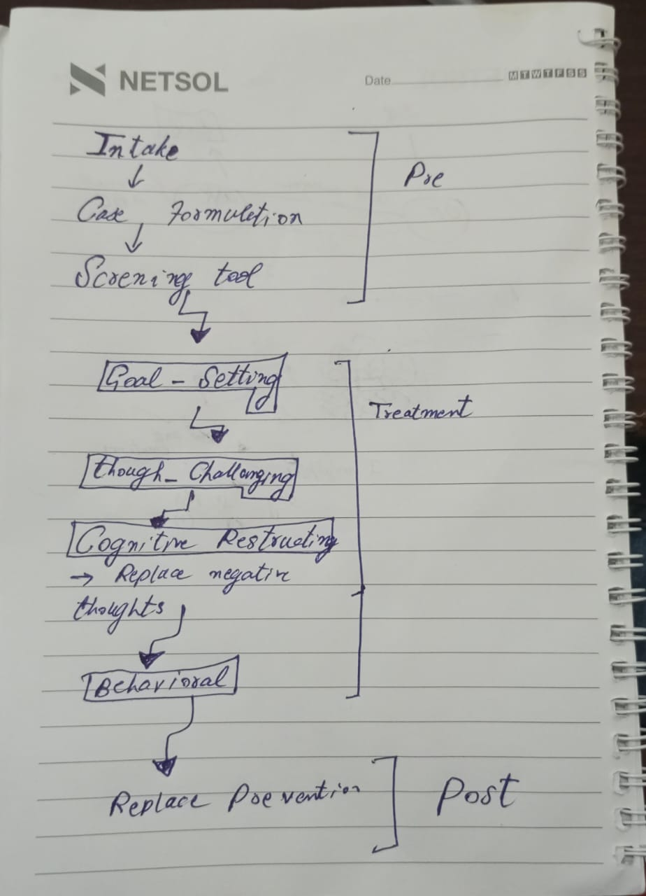
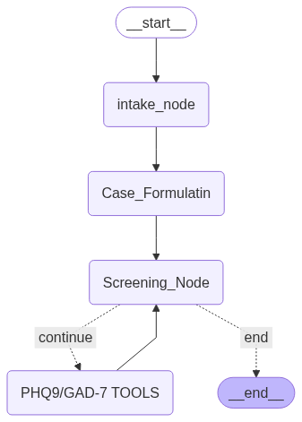
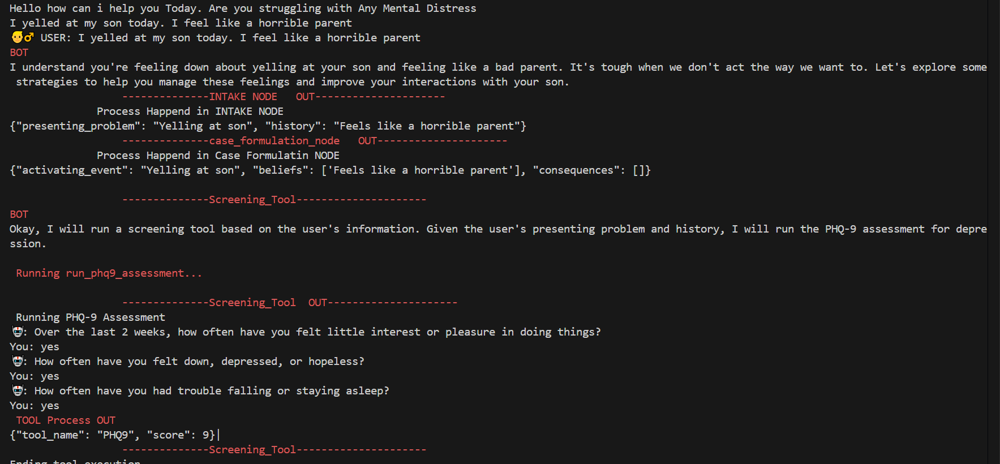

# 🧠 CBT Therapy Chatbot with LangGraph,

An interactive CBT (Cognitive Behavioral Therapy) chatbot built using the **Gemini API**, **LangChain**, and **LangGraph**. This system simulates therapy stages with structured flow, tools like PHQ-9/GAD-7.
---------

## 📈 Project Flows

### ✅ Proposed Full CBT Flow
> Full roadmap of intended features and flow structure    to be implemented


---

### ✅ Current Implemented Flow
> What has been built and is working today


---

## 📁 Project Structure
CBT_CHATBOT/
│
├── after_experimentations/      ->  Conversion To code after Jupyter NoteBook Experiments
│ ├── CBT_State.py               ->  This file is for Current States Of our Graph 
│ ├── Graph.py                   ->  Graph/Tools initialization
│ └── main.py                    ->   Uses Compiled Graph from Graph.py and Stream it
│
├── Experimentations/
│ 
│ ├── Documentation-Scripts.ipynb      -> Documentaion/Articlle/ai  scripts
│ ├── Testing_Flow.ipynb               -> Initial Experimentation Before Compilation
├── .gitignore
├── image.png
├── img2.jpg
└── README.md


### 🧭 Recommended File Navigation

To understand how the chatbot works:

#### Start with:
📘 `Experimentations/Testing_Flow.ipynb`  
*This notebook contains the early-stage design and logic testing of the CBT chatbot.*

#### Then explore:
💻 `after_experimentations/` folder  
*This contains the final converted Python code based on the experimental logic:*

- `CBT_State.py`: Defines state schema and tracking.  
- `Graph.py`: Builds the LangGraph logic and tool nodes.  
- `main.py`: Streams responses using the compiled graph.


## 🔧 Tech Stack

| Component       | Used Tool/Library        |
|----------------|--------------------------|
| LLM             | Gemini API (Google)      |
| Framework       | LangGraph                |     
| Emotional Tools | PHQ-9, GAD-7 (custom tools) |
| Language        | Python                   |

---


## Example Output



## 🚀 How to Run the Project

To get started with the CBT Chatbot:

### 1. Install Dependencies

Make sure you have Python installed (preferably Python 3.10+), then install all required packages:

```bash
pip install -r requirements.txt
